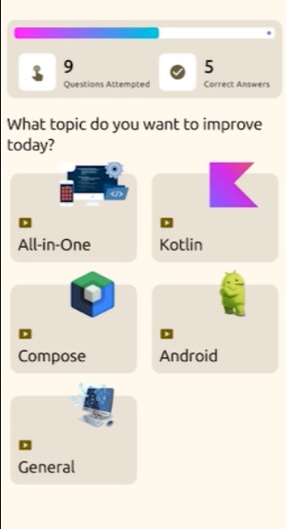
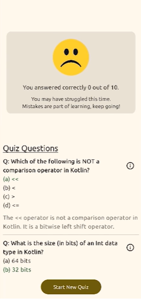
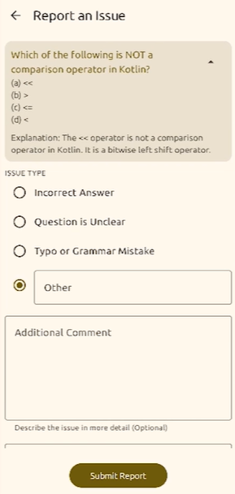

# QuizTime 🧠📱

QuizTime is a quiz application built using Kotlin and Jetpack Compose. It enables users to test their knowledge through engaging quizzes, with a seamless backend powered by Ktor and MongoDB Atlas.

---

## 📷 Screenshots

<!-- Include some screenshots here if available -->

  
  
  
  

---

## 🚀 Features

- 📋 Quiz with multiple categories
- 💡 Instant feedback on answers
- 📊 Score tracking and progress visualization
- 🌐 Full-stack integration with Ktor backend
- 🧱 Built with MVVM architecture and Clean Architecture principles
- ☁️ Cloud database using MongoDB Atlas
- 🧪 Ensured best practices for maintainable, scalable code

---

## 🛠️ Tech Stack

### Frontend
- **Kotlin**
- **Jetpack Compose**
- **Koin** for dependency injection
- **MVVM + Clean Architecture** for scalable design

### Backend
- **Ktor** (Kotlin Server Framework)
- **MongoDB Atlas** (Cloud-hosted NoSQL Database)

